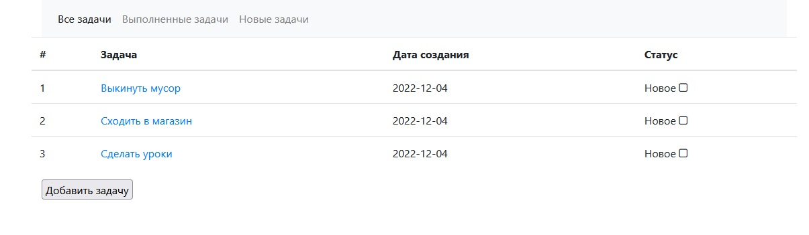
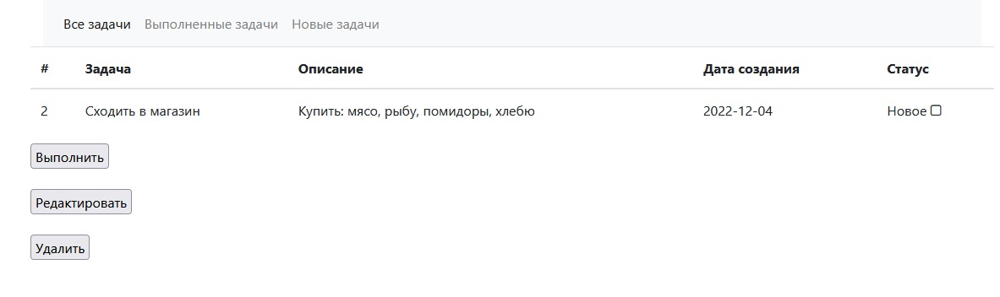
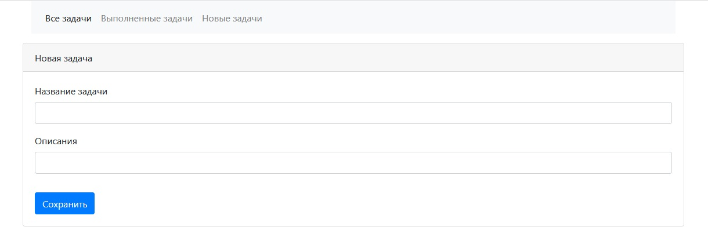
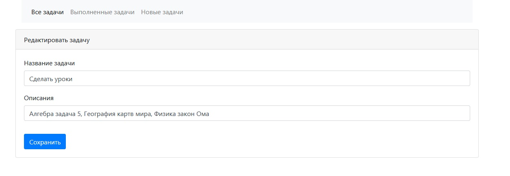
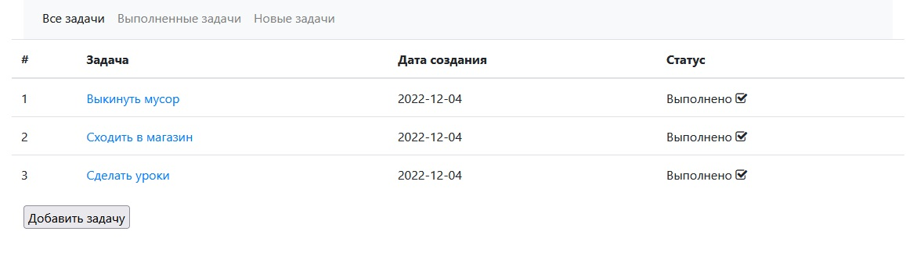

# job4j_todo

## *TODO LIST*

### *Описание*
Web приложение для создания и управления своими задачами.
Есть возможность: добавлять, отмечать выполненые задачи, редактировать и удалять.
    
### *Стек технологий*

1. Spring boot 2.7.3
2. Thymeleaf 2.7.3
3. Bootstrap 4.4.1
4. Hibernate 5.6.11 Final
5. PostgreSql 14.1
6. Lombok 1.18.22
      
### *Требование к окружению*
Java 17, Maven 3.8, PostgreSQL 14

### *Список невыполненых задач*

### *Подробности задачи*

### *Добавление задачи*

### *Редактирование задачи*

### *Список выполненых задач задач*
